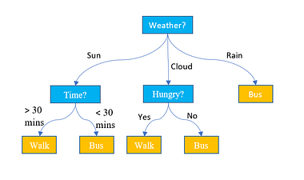
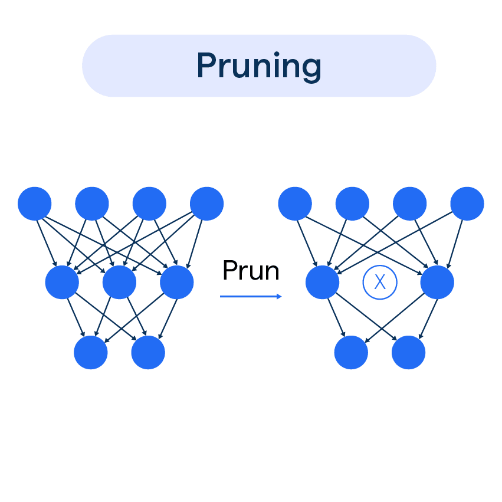

# 🌳 Decision Tree Induction
Decision tree induction is a popular supervised learning technique in data mining used to build a
flowchart-like model that predicts outcomes (classification or regression) by learning simple decision rules from data features. It works by recursively partitioning the dataset into smaller, purer subsets based on the most significant attributes, starting from a single root node. 
Key Components
A decision tree is composed of three main types of nodes: 
    Root Node: The topmost node representing the entire dataset and the initial decision point.
    Internal Nodes (Decision Nodes): Nodes where the data is split based on a test condition of an attribute (e.g., "Age > 30?").
    Leaf Nodes (Terminal Nodes): The final nodes of the tree that represent the ultimate prediction or class label (e.g., "Yes, the customer buys a computer" or "No").
    Branches: The lines connecting nodes, each representing the outcome of a test condition

> **"The Expert's Logic Flow"** — When an expert doctor diagnoses a patient, they don't look at 50 symptoms at once. They ask the *most critical question first*. Based on that answer, they ask the next most relevant question — until they reach a conclusion.
>
> **Decision Tree Induction** is the process of extracting these expert rules from raw data automatically. It turns a messy dataset into a clean, logical flowchart.

## Types of Decision Trees
1) Regression based decision trees
    Regression is used when the data that we have and the data that we are making predictions on are continuous.

2) Classification based decision trees.
    Classification is used when the data we have and the data that we are making predictions on are discrete(or)categorical.

Let's understand the meaning of discrete and continuous data. Ever heard of something like “The system has half defect”? No right!. A system either has a complete defect or no defect at all. There are no halves, quarters, or fractions. This type of data is called Discrete data ex: Yes/no, Good/bad, etc. Only a finite number of values are possible, and the values cannot be subdivided further.

Continuous data is data that can be measured and broken down into smaller parts and still have meaning. Money, temperature, and time are continuous. Ex: If you have many pizzas then counting the no. of pizzas is discrete and measuring each pizza and recording the size (i.e 25.225.2 cm, 26.126.1 cm, 29.529.5 cm, etcetc) that’s continuous data.
Important Terminologies Related to Decision Trees

    Root Node: The root node is the very first node in the tree. This node initiates the whole decision-making process by further getting divided into 2 or more sets of nodes and each node consists of a feature in the data set.
    Splitting: A node is broken down into sub-nodes at every level and this process is called splitting.
    Decision Node: When a node can be broken down into 2 or more nodes then it's called a decision node. This breaking down happens according to the number of different decisions that can be made from that particular node.
    Leaf / Terminal Node: Nodes that cannot be broken down into sub-nodes anymore.
    Pruning: This is the process of removing an unwanted part of a tree. To be precise it can be a node (or) a branch in the tree too.
    Branch / Sub-Tree: When a tree is split into different sub-parts it is known to be a branch in a tree (or) a subtree.
    Parent and Child Node: When a node is divided into sub-nodes the sub-nodes are called the child nodes and the node that got split is called the parent node of all these child nodes.


Assumptions While Creating a Decision Tree

    All the training data is passed to the root node. Training data is the data that we use to train the machine model and the model learns using this data and makes predictions on the test data.
    The features (or) the attributes in the dataset are preferred to be categorical (or) discrete .
    If the features are continuous in the data set, they are discretized before data modeling.
    Recursive distribution of the records is done on the values of the feature/attribute.
    The order of having a root node followed by internal nodes followed by leaf nodes is done using statistical methods.

## Algorithms

    ID3 : ID3 stands for Iterative Dichotomiser 3 . This algorithm iteratively divides features into two or more groups at each step. Here "Iterative" means continuous/repeated and "dichotomiser" means dividing. ID3 follows a top-down approach i.e the tree is built from the top and at every step greedy approach is applied. The greedy approach means that at each iteration we select the best feature at the present moment to create a node and this node is again split after applying some statistical methods. ID3 generally is not a very ideal algorithm as it overfits when the data is continuous.

    C4.5: It is considered to be better than the ID3 algorithm as it can handle both discrete and continuous data. In C4.5 splitting is done based on Information gain (attribute selection measure ) and the feature with the highest Information gain is made the decision node and is further split. C4.5 handles overfitting by the method of pruning i.e it removes the branches/subpart of the tree that does not hold much importance (or) is redundant. To be specific, C4.5 follows post pruning i.e removing branches after the tree is created.

    CART: CART stands for classification and regression trees. As the name suggests CART can also perform both classification and regression-based tasks. CART uses Gini’s impurity index as an attribute selection method while splitting a node into further nodes when it's a classification-based use case and uses sum squared error as an attribute selection measure when the use case is regression-based. While CART uses Gini Index as an ASM(attribute selection measure), C4.5 and ID3 use information gain as an ASM.

    CHAID: CHAID stands for Chi-square Automatic Interaction Detector. It is known to be the oldest of all three algorithms in history and is used very less these days. In CHAID chi-square is the attribute selection measure to split the nodes when it's a classification-based use case and uses F-test as an attribute selection measure when it is a regression-based use case. Higher the chi-square value higher is the preference given to that feature. The major difference between CHAID and CART is, CART splits one node into two nodes whereas CHAID splits one node into 2 or more nodes.

    MARS: MARS stands for Multivariate adaptive regression splines. It is an algorithm that was specifically designed to handle regression-based tasks, provided, the data is non-linear.

## Why Use Decision Trees?

Here are some of the reasons that state why we should use decision trees while working on machine learning use cases.

1) While using decision trees we get to see the problem more clearly and understand which node is giving rise to what as it forms a tree-like structure. A decision tree almost works like a person doing their day-to-day activities and taking the best decisions related to a certain situation based on various deciding factors.

2) Decision trees help us to see all possible cases that a decision can lead to and help us make the decision accordingly.

3) It helps us in mathematically finding out the probabilities of achieving a certain outcome
How Does Decision Tree Algorithm Work?

Let's look at the steps that the decision tree algorithm follows.

Step 1: The first node of the tree is always the root node and it consists of the whole dataset. Let's refer to the root node as S.

Step 2: Use attribute selection measures to find the best attribute.

Step 3: Now divide the root node (S) into subsets that contain various possible values of the best attribute that you found out in step 2.

Step 4: Now generate a decision tree node that consists of the best attribute.

Step 5: Now make new decision trees using the subsets that were created in step - 3. Do this step recursively till the node cannot be divided anymore i.e leaf node.


Let's say there is a student who wants to join an engineering college and wants to decide among the various options he/she has.

Let's approach this problem using decision trees. The decision tree starts with the root node (S)(S), here let us consider the root node as the college ranking by considering attribute selection measures.

The root node then splits into the next decision node(placements at college) & a leaf node( not opting for the college because the college ranking isn't good ).

The next decision node further gets split into one decision node ( distance of college from home) and one leaf node ( not opting for the college because the placements aren't good ). Lastly, the decision node splits into two leaf nodes ( Opting for the college and Not opting for the college.). Consider the below diagram.
Attribute Selection Measures

In general, there are different features/attributes in a dataset. We randomly cannot make a feature/attribute as the root node and then follow the same for every decision node. Doing so would lead to a very wrong model that will make wrong decisions based on unuseful features.

So to solve this problem, we have something called Attribute Selection Measures (ASM).


Here is a list of some attribute selection measures.

    Entropy
    Information gain
    Gini index
    Gain Ratio
    Reduction in Variance
    Chi-Square**

Let's discuss each one of them:
Entropy

It is the measure of impurity (or) uncertainty in the data. It lies between 0 to 1 and is calculated using the below formula.


For example, let's see the formula for a use case with 2 classes- Yes and No.

Entropy(s)Entropy(s)= −P(Yes)log2P(Yes)−P(No)log2P(No)−P(Yes)log2​P(Yes)−P(No)log2​P(No)

Here Yes and No are two classes and s is the total number of samples. P(Yes) is the probability of Yes and P(No) is the probability of No.

If there are many classes then the formula is

−P1log2P1−P2log2P2−.......−Pnlog2Pn−P1​log2​P1​−P2​log2​P2​−.......−Pn​log2​Pn​

Here n is the number of classes.

The entropy of each feature after every split is calculated and the splitting is continued. The lesser the entropy the better will be the model because the classes would be split better because of less uncertainty.
Information Gain

Information gain is simply the measure of change in entropy. The higher the information gain, the lower is the entropy. Thus for a model to be good, it should have high Information gain. A decision tree algorithm in general tries to maximize the value of information gain, and an attribute/feature having the highest information gain is split first.

InformationGain=EntropyBeforeSplit−EntropyAfterSplitInformationGain=EntropyBeforeSplit−EntropyAfterSplit


Where “before” is the dataset before the split, N is the number of subsets that got generated after we split the node, and (i, after) is the subset 'i' after the split.
Gini Index

It is a measure of purity or impurity while creating a decision tree. It is calculated by subtracting the sum of the squared probabilities of each class from one. It is the same as entropy but is known to calculate quicker as compared to entropy. CART ( Classification and regression tree ) uses the Gini index as an attribute selection measure to select the best attribute/feature to split. The attribute with a lower Gini index is used as the best attribute to split.


Here 'i' is the no. of classes.
Gain Ratio

The Gain Ratio solves the problem of Bias in Information gain. Information gain shows bias towards the nodes that have a large number of values i.e if an attribute has a large set of values in the data set then makes it a root node. This is something that isn't appreciated while designing a model, so to solve this problem of bias, the number of branches that a node would split into is something that is taken under consideration by the gain ratio while splitting a node. The gain ratio is defined as the ratio of information gain and intrinsic information (or) split info.

Here intrinsic information/split info refers to the entropy of sub-dataset proportions.

The formula for gain ratio is:


Reduction in variance

It is used when the data we have is continuous in nature. Variance simply refers to the change in the model when using different subparts of the training data. The split with lower variance is taken into consideration. To use variance as an attribute selection measure, firstly calculate variance for each node followed by calculating variance for each split.


X bar is the mean of the values, X is actual and n is the number of values.
Chi-Square

Chi-Square is a comparison between observed results and expected results. This statistical method is used in CHAID(Chi-square Automatic Interaction Detector). CHAID in itself is a very old algorithm that is not used much these days. The higher the value of chi-square, higher is the difference between the current node and its parent.

The formula for chi - square is


Advantages and Disadvantages
Advantages

    Decision tree can work on both categorical and numeric data.
    This algorithm does not need much preprocessing of the data set. Here preprocessing refers to cleaning (or) normalizing (or) scaling the dataset. Thus it is considered a better algorithm when compared to other algorithms.
    Decision tree can be easily understood by any layperson as it mimics the nature of the human when making a decision.
    Decision tree helps us to think about all possible outcomes that a decision can lead to.

Disadvantages

    Decision tree is not that efficient when it comes to regression-based use cases.
    If the class labels are more, the depth of the tree increases. Thus making the algorithm more time taking to perform calculations for every label. This leads to more training time.
    Decision tree sometimes faces the problem of overfitting that can be resolved by certain methods like pruning, discretizing the data, using random forest algorithm.

Applications

Decision trees are used in various sectors & disciplines in the world. Let's look at a few.
Education
The education sector takes uses student data like marks in boards, marks in the entrance test, the reservation that a student holds, etc., and gives rankings to a student that he/she uses to join colleges/organizations.
Banking & Finance
When a customer of a bank approaches for a loan, his/her capability to pay the bank loan is calculated using decision trees. Here the factors that decide if he/she can pay back the loan are age, salary, no. of members in the family, existing loans, etc. Other than this, fraud detection in the finance sector is also something that the decision tree algorithm facilitates.
Healthcare & Diagnosis
In the healthcare sector, decision trees are used to check whether a person is suffering from a disease or not by taking some health factors into consideration. For example: Classify if a person has cancer, classify if a person has diabetes, etc.
Marketing and Business Growth
argeted advertisements are something that businesses do in order to market their product, decision tree in this case helps in segmenting the audience that can be targeted using some factors like age of the audience, location of the audience, mindset of the audience, etc. Speaking about the growth of the business, the past sales data of the company is taken under condition and analyzed in order to find patterns that can be used to make any business strategies in the current scenario of the business.
How to Avoid Overfitting in Decision Trees?

Overfitting is a scenario that occurs when the machine learning model completely fits the training data ( learns everything in detail about the training data) such that it fails while performing on the new test data set. Example: Let's say you practice trigonometry formulas for a week and you know them by heart. Now in the exam, you get questions based on calculus, will you be able to perform well (or) will you fail? This is exactly what happens in overfitting.

In Decision trees, there might be chances of overfitting sometimes. So, let's understand some methods using which we can avoid overfitting in decision trees.
Pruning

Pruning is simply cutting off the branches of the decision tree. Here we prune out the branches that do not hold much importance (or) are redundant. Pruning out branches means removing the features of the dataset that do not contribute much to making decisions in a decision tree. There are 2 types of pruning Pre pruning & Post pruning. Pre pruning is when the branches/subparts/sections of a tree are removed during setting up a tree. Post pruning is when branches/subparts/sections of a tree are removed after the tree is completely constructed.
Discretization

Making data discretized is something that is necessary in order to control overfitting because when the data is continuous, the model finds it hard to make decisions.
Using Ensemble methods (or) Random Forest Algorithm

Random forest is an ensemble-based learning algorithm. Ensemble learning is simply the combination of 2 or more machine learning algorithms in order to increase the performance of accuracy while generating predictions. Ensembling prevents overfitting by resampling the training data continuously and helps generate many decision trees for the same data set.
Which is Better Linear or Tree-based Models?

Before we answer this question let's see what these two terms mean. The linear model means that if we plot all the features/attributes in a data set including the outcome variable, there is a straight line or a hyperplane that we can draw in order to roughly estimate the outcome variable. Tree-based models are something that we already discussed in this article.

The answer to the question "Which is better Linear or tree-based models?" depends on the type of use case that we are trying to solve.

    When the variables in the data set are of a categorical type, tree-based models have an upper hand over linear models.
    If there is a heavy amount of non-linearity and the relationship between dependent and independent variables is complex, tree-based algorithms are way better as compared to linear models.
    If the relationship between dependent and independent variables can be plotted and a straight line of fit can be drawn to approximate the outcome variable then in that case linear models are better than tree-based models.
    Tree-based models are easy to understand and explain as compared to linear models.


## 📋 Table of Contents

1. [Anatomy of a Decision Tree](#1-anatomy-of-a-decision-tree)
2. [How the Tree Decides — Attribute Selection Measures](#2-how-the-tree-decides)
3. [The Induction Process — Recursive Partitioning](#3-the-induction-process)
4. [Full Worked Example (ID3)](#4-full-worked-example-id3--play-tennis)
5. [Simple Example — Student Pass/Fail](#5-simple-example--student-passfail)
6. [Combatting Overfitting — Tree Pruning](#6-combatting-overfitting--tree-pruning)
7. [Handling Missing & Continuous Values](#7-handling-missing--continuous-values)
8. [Regression Trees (CART)](#8-decision-trees-for-regression)
9. [Ensemble Methods](#9-ensemble-methods-taking-trees-further)
10. [Evaluation Metrics](#10-evaluating-a-decision-tree)
11. [Feature Importance](#11-feature-importance)
12. [Algorithm Comparison](#12-algorithm-comparison)
13. [Hyperparameter Tuning](#13-hyperparameter-tuning)
14. [Pros and Cons](#14-pros-and-cons)
15. [vs. Other Classifiers](#15-decision-trees-vs-other-classifiers)
16. [Python Implementation](#16-python-implementation)
17. [Real-World Applications](#17-real-world-applications)

---

## 1. Anatomy of a Decision Tree

A Decision Tree is a **directed acyclic graph (DAG)** where every path from root to leaf represents a classification rule.

### 🏗️ Components

```
                            ┌─────────────────────┐
                            │     ROOT NODE        │  ← Entire dataset lives here.
                            │     [Outlook?]        │    Best attribute chosen first.
                            └──────────┬──────────┘
                    ┌─────────────────┼──────────────────┐
                    │ Sunny           │ Overcast          │ Rain
                    ▼                 ▼                   ▼
          ┌──────────────┐  ┌──────────────┐   ┌──────────────┐
          │ INTERNAL NODE│  │  LEAF NODE   │   │ INTERNAL NODE│  ← Internal nodes
          │ [Humidity?]  │  │   ✅ YES      │   │  [Wind?]     │    test ONE attribute
          └──────┬───────┘  └──────────────┘   └──────┬───────┘
          ┌──────┴──────┐                      ┌──────┴──────┐
          │ High        │ Normal               │ Strong      │ Weak
          ▼             ▼                      ▼             ▼
     ┌─────────┐  ┌─────────┐           ┌─────────┐  ┌─────────┐
     │  LEAF   │  │  LEAF   │           │  LEAF   │  │  LEAF   │
     │  ❌ NO  │  │  ✅ YES │           │  ❌ NO  │  │  ✅ YES │
     └─────────┘  └─────────┘           └─────────┘  └─────────┘
```

| Node Type | Role | Has Children? |
|:---|:---|:---|
| **Root Node** | Top of the tree — the best splitting attribute | Yes |
| **Internal (Decision) Node** | Tests one attribute, creates branches | Yes |
| **Branch** | An outcome of the attribute test | — |
| **Leaf Node** | Final class label — the answer | **No** |

> 💡 **Key Insight:** A binary tree of depth $d$ can have at most $2^d$ leaf nodes. Deeper trees are more expressive but *more prone to overfitting*.



---

## 2. How the Tree Decides

The tree doesn't pick attributes randomly. It uses **Attribute Selection Measures (ASM)** to find the attribute that creates the "purest" child nodes — maximally separating the classes.

---

### 📐 A. Entropy — The Measure of Chaos

> **Entropy** measures the *disorder* or *impurity* of a dataset. A pure node (all one class) has entropy = 0. A perfectly mixed node has maximum entropy.

$$
\boxed{H(S) = -\sum_{i=1}^{c} p_i \log_2(p_i)}
$$

**Where:**
- $p_i$ = proportion of class $i$ in dataset $S$
- $c$ = number of distinct classes
- Convention: $0 \cdot \log_2(0) = 0$

**Entropy Visualized:**

```
Entropy
  1.0 │                ★ Maximum disorder
      │           ___/★\___
  0.8 │         _/         \_
      │        /             \
  0.6 │       /               \
      │      /                 \
  0.4 │     /                   \
      │    /                     \
  0.2 │   /                       \
      │  /                         \
  0.0 │ ★                           ★
      └────────────────────────────────
      0%  10%  30%  50%  70%  90% 100%
      ← All "No"         All "Yes" →

      Pure = 0              Pure = 0
      (Entropy = 0)     (Entropy = 0)
```

**Reference Table:**

| Scenario | Entropy |
|:---|:---|
| 100% one class | **0.0** (perfectly pure ✅) |
| 90% / 10% two classes | **0.469** |
| 70% / 30% two classes | **0.881** |
| 50% / 50% two classes | **1.0** (maximum disorder ⚠️) |
| 33% / 33% / 33% three classes | **1.585** |
| 25% / 25% / 25% / 25% four classes | **2.0** |

**Worked Calculation:**

```
Dataset: 9 Yes, 5 No out of 14 total

p(Yes) = 9/14 = 0.643
p(No)  = 5/14 = 0.357

H(S) = -(0.643 × log₂(0.643)) - (0.357 × log₂(0.357))
     = -(0.643 × -0.637) - (0.357 × -1.485)
     = 0.410 + 0.530
     = 0.940 bits
```

---

### 📐 B. Information Gain — Used by ID3

> **Information Gain** measures the *reduction in entropy* achieved by splitting on attribute $A$. The higher the gain, the more useful the attribute.

$$
\boxed{\text{Gain}(S, A) = H(S) - \sum_{v \in \text{Values}(A)} \frac{|S_v|}{|S|} \cdot H(S_v)}
$$

**Intuition diagram:**

```
Before Split:          After Split on Attribute A:
  
  ●●●●●●●●●             Branch 1:   Branch 2:   Branch 3:
  ○○○○○               ●●●●●●●●    ○○○○○       ●○●○●
  H(S) = 0.94         H = 0.0     H = 0.0     H = 1.0

Information Gain = H(before) - weighted H(after)
                 = 0.94 - [w₁×0.0 + w₂×0.0 + w₃×1.0]
```

> ⚠️ **Drawback of Information Gain:** Biased toward attributes with *many distinct values* (e.g., `Customer_ID` gives perfect splits but is useless for prediction). **C4.5 fixes this with Gain Ratio.**

---

### 📐 C. Gain Ratio — Used by C4.5

> **Gain Ratio** normalizes Information Gain by the **Split Information** — a penalty for attributes that create many branches.

$$
\boxed{\text{GainRatio}(S, A) = \frac{\text{Gain}(S, A)}{\text{SplitInfo}(S, A)}}
$$

$$
\text{SplitInfo}(S, A) = -\sum_{v \in \text{Values}(A)} \frac{|S_v|}{|S|} \log_2 \frac{|S_v|}{|S|}
$$

**Example of why this matters:**

```
Attribute A: Customer_ID  (1000 unique values)
  → Gain is very high (perfect split)
  → SplitInfo is also very high (many branches)
  → GainRatio is LOW → correctly penalized ✅

Attribute B: Gender  (2 values)
  → Gain may be moderate
  → SplitInfo is low (only 2 branches)
  → GainRatio may be HIGH → selected appropriately ✅
```

---

### 📐 D. Gini Index — Used by CART

> The **Gini Index** measures the probability that a randomly chosen element would be *incorrectly classified* if randomly labeled according to the class distribution.

$$
\boxed{\text{Gini}(S) = 1 - \sum_{i=1}^{c} p_i^2}
$$

For a **binary split** on attribute $A$ into subsets $S_1$ and $S_2$:

$$
\text{Gini}_A(S) = \frac{|S_1|}{|S|} \cdot \text{Gini}(S_1) + \frac{|S_2|}{|S|} \cdot \text{Gini}(S_2)
$$

> 🎯 **Choose the attribute with the LOWEST Gini Index.**

**Worked Example:**

```
Dataset: 7 Yes (●), 3 No (○) → total = 10

Gini(S) = 1 - [(7/10)² + (3/10)²]
        = 1 - [0.49 + 0.09]
        = 1 - 0.58
        = 0.42
```

**Gini vs. Entropy Comparison:**

| Distribution | Entropy | Gini |
|:---|:---|:---|
| 100% / 0% | **0.000** | **0.000** |
| 90% / 10% | 0.469 | 0.180 |
| 70% / 30% | 0.881 | 0.420 |
| 50% / 50% | **1.000** | **0.500** |

> 💡 Both reach 0 for pure nodes and peak for equal distributions. In practice they yield similar trees. **Gini is computationally faster** (no logarithm).

---

### 🔄 ASM Decision Flowchart

```
              Start: Which measure to use?
                           │
              ┌────────────┼────────────┐
              │            │            │
        Algorithm?     Algorithm?   Algorithm?
           ID3            C4.5         CART
              │            │            │
              ▼            ▼            ▼
       Information      Gain          Gini
          Gain           Ratio        Index
              │            │            │
              ▼            ▼            ▼
       Maximize        Maximize      Minimize
         Gain         GainRatio       Gini
```

---

## 3. The Induction Process

The algorithm follows a **Greedy, Top-Down, Recursive** strategy — also called **Recursive Partitioning**.

### 🔁 Algorithm Flowchart

```
┌─────────────────────────────────────────────────────────────────────┐
│              DECISION TREE INDUCTION ALGORITHM                       │
├─────────────────────────────────────────────────────────────────────┤
│                                                                     │
│   INPUT: Dataset D, Attribute List A                                │
│   OUTPUT: A Decision Tree                                           │
│                                                                     │
│   ┌─────────────────────────────────────┐                          │
│   │  Create a new node N                │                          │
│   └──────────────┬──────────────────────┘                          │
│                  │                                                  │
│                  ▼                                                  │
│   ┌──────────────────────────────────────────────┐                 │
│   │  Are all samples in D the same class C?      │                 │
│   └──────────────────────────────────────────────┘                 │
│                  │                                                  │
│         YES ─────┼───── NO                                         │
│          │                │                                         │
│          ▼                ▼                                         │
│   ┌────────────┐  ┌───────────────────────────────────┐            │
│   │  Return N  │  │  Is the attribute list A empty?   │            │
│   │  as LEAF   │  │  OR minimum samples reached?      │            │
│   │  (class C) │  └───────────────────────────────────┘            │
│   └────────────┘              │                                     │
│                       YES ────┼──── NO                              │
│                        │           │                                │
│                        ▼           ▼                                │
│                 ┌────────────┐  ┌──────────────────────────────┐   │
│                 │ Return N   │  │ For each attribute in A:     │   │
│                 │ as LEAF    │  │   Calculate Gain (or Gini)   │   │
│                 │ (majority) │  └──────────────────────────────┘   │
│                 └────────────┘              │                       │
│                                            ▼                       │
│                                 ┌────────────────────────────┐     │
│                                 │ Select A* = Best Attribute │     │
│                                 │ (Max Gain or Min Gini)     │     │
│                                 └────────────────────────────┘     │
│                                            │                       │
│                                            ▼                       │
│                                 ┌────────────────────────────┐     │
│                                 │ Label node N with A*       │     │
│                                 └────────────────────────────┘     │
│                                            │                       │
│                                            ▼                       │
│                        ┌────────────────────────────────────┐      │
│                        │ For each value v of A*:            │      │
│                        │   Create branch v from N           │      │
│                        │   Let D_v = subset where A* = v    │      │
│                        │   If D_v is empty:                 │      │
│                        │     Attach leaf = majority class   │      │
│                        │   Else:                            │      │
│                        │     Recurse: GenerateTree(D_v, A-A*)│     │
│                        └────────────────────────────────────┘      │
│                                                                     │
└─────────────────────────────────────────────────────────────────────┘
```

### 🛑 Stopping Conditions (When Does Recursion Stop?)

```
A branch becomes a LEAF node when ANY of these occur:
┌─────────────────────────────────────────────────────────┐
│                                                         │
│  1. PURE NODE                                           │
│     All samples belong to the same class               │
│     → Leaf = that class                                 │
│                                                         │
│  2. NO ATTRIBUTES LEFT                                  │
│     All attributes have been used                      │
│     → Leaf = majority class                             │
│                                                         │
│  3. EMPTY SUBSET                                        │
│     No samples reached this branch                     │
│     → Leaf = parent's majority class                   │
│                                                         │
│  4. PRE-PRUNING THRESHOLD (optional)                    │
│     Node has fewer than min_samples samples            │
│     → Leaf = majority class                             │
│                                                         │
└─────────────────────────────────────────────────────────┘
```

### 🔀 Handling Split Types

| Attribute Type | ID3 / C4.5 | CART |
|:---|:---|:---|
| **Categorical** (Weather = Sunny/Cloudy/Rain) | Multi-way split — one branch per value | Binary split — group values into 2 subsets |
| **Numerical** (Age = 25.5) | Sort values, find best threshold | Sort values, test every midpoint as threshold |

**Numerical Split Example:**

```
Age values: [22, 25, 28, 35, 40, 55]

Candidate thresholds: 23.5, 26.5, 31.5, 37.5, 47.5

Test each:  Age ≤ 23.5  → {22} vs {25,28,35,40,55}
            Age ≤ 26.5  → {22,25} vs {28,35,40,55}
            Age ≤ 31.5  → {22,25,28} vs {35,40,55}
            Age ≤ 37.5  → {22,25,28,35} vs {40,55}   ← Best Gain?
            Age ≤ 47.5  → {22,25,28,35,40} vs {55}

Pick the threshold that gives maximum Gain (or minimum Gini).
```

---

## 4. Full Worked Example (ID3 — Play Tennis)

**Goal:** Build a Decision Tree to predict if tennis should be played, given weather conditions.

### 📋 Dataset

| Day | Outlook | Temperature | Humidity | Wind | Play? |
|:---|:---|:---|:---|:---|:---|
| D1 | Sunny | Hot | High | Weak | ❌ No |
| D2 | Sunny | Hot | High | Strong | ❌ No |
| D3 | Overcast | Hot | High | Weak | ✅ Yes |
| D4 | Rain | Mild | High | Weak | ✅ Yes |
| D5 | Rain | Cool | Normal | Weak | ✅ Yes |
| D6 | Rain | Cool | Normal | Strong | ❌ No |
| D7 | Overcast | Cool | Normal | Strong | ✅ Yes |
| D8 | Sunny | Mild | High | Weak | ❌ No |
| D9 | Sunny | Cool | Normal | Weak | ✅ Yes |
| D10 | Rain | Mild | Normal | Weak | ✅ Yes |
| D11 | Sunny | Mild | Normal | Strong | ✅ Yes |
| D12 | Overcast | Mild | High | Strong | ✅ Yes |
| D13 | Overcast | Hot | Normal | Weak | ✅ Yes |
| D14 | Rain | Mild | High | Strong | ❌ No |

**Summary:** Total = 14 | ✅ Yes = 9 | ❌ No = 5

---

### 🧮 Step 1 — Total Entropy of Dataset S

$$
H(S) = -\frac{9}{14}\log_2\!\frac{9}{14} - \frac{5}{14}\log_2\!\frac{5}{14}
$$

```
p(Yes) = 9/14 ≈ 0.643   →  -0.643 × log₂(0.643) = -0.643 × (-0.637) = 0.410
p(No)  = 5/14 ≈ 0.357   →  -0.357 × log₂(0.357) = -0.357 × (-1.485) = 0.530

H(S) = 0.410 + 0.530 = 0.940 bits
```

---

### 🧮 Step 2 — Information Gain for Each Attribute

#### 📌 Outlook (Sunny=5, Overcast=4, Rain=5)

```
Subset breakdown:
┌───────────────────────────────────────────────────────┐
│ Outlook = Sunny   : D1,D2,D8,D9,D11 → Yes=2, No=3    │
│ Outlook = Overcast: D3,D7,D12,D13   → Yes=4, No=0    │
│ Outlook = Rain    : D4,D5,D6,D10,D14→ Yes=3, No=2    │
└───────────────────────────────────────────────────────┘

H(Sunny)    = -(2/5)log₂(2/5) - (3/5)log₂(3/5) = 0.971
H(Overcast) = -(4/4)log₂(4/4) = 0.000  ✅ PURE!
H(Rain)     = -(3/5)log₂(3/5) - (2/5)log₂(2/5) = 0.971

Gain(S, Outlook) = 0.940 - [ (5/14)×0.971 + (4/14)×0.000 + (5/14)×0.971 ]
                 = 0.940 - [ 0.347 + 0.000 + 0.347 ]
                 = 0.940 - 0.694
                 = 0.246 ✅
```

#### 📌 Humidity (High=7, Normal=7)

```
H(High)   = -(3/7)log₂(3/7) - (4/7)log₂(4/7) = 0.985
H(Normal) = -(6/7)log₂(6/7) - (1/7)log₂(1/7) = 0.592

Gain(S, Humidity) = 0.940 - [ (7/14)×0.985 + (7/14)×0.592 ]
                  = 0.940 - 0.789
                  = 0.151
```

#### 📌 Wind (Weak=8, Strong=6)

```
H(Weak)   = -(6/8)log₂(6/8) - (2/8)log₂(2/8) = 0.811
H(Strong) = -(3/6)log₂(3/6) - (3/6)log₂(3/6) = 1.000

Gain(S, Wind) = 0.940 - [ (8/14)×0.811 + (6/14)×1.000 ]
              = 0.940 - 0.892
              = 0.048
```

#### 📌 Temperature (Hot=4, Mild=6, Cool=4)

```
Gain(S, Temperature) ≈ 0.029  (lowest gain)
```

---

### 🏆 Step 3 — Select Root Node

```
Attribute       Information Gain     Winner?
─────────────────────────────────────────────
Outlook         0.246               🏆 HIGHEST → ROOT
Humidity        0.151
Wind            0.048
Temperature     0.029               ← Lowest
```

**Outlook** is selected as the **Root Node**.

---

### 🔁 Step 4 — Recurse on Sub-branches

The **Overcast** branch is immediately a leaf (pure "Yes"). The other two branches continue splitting:

```
Sunny branch (Yes=2, No=3):
  → Try Humidity, Wind, Temperature
  → Humidity gives best gain
  → Humidity=High → No,  Humidity=Normal → Yes

Rain branch (Yes=3, No=2):
  → Try Wind, Temperature
  → Wind gives best gain  
  → Wind=Strong → No,  Wind=Weak → Yes
```

---

### 🌳 Final Decision Tree

```
                        ┌───────────────┐
                        │    Outlook?    │
                        └───────┬───────┘
           ┌───────────────────┼───────────────────┐
           │ Sunny             │ Overcast           │ Rain
           ▼                   ▼                   ▼
    ┌─────────────┐    ┌───────────────┐    ┌─────────────┐
    │  Humidity?  │    │  ✅ Play=YES  │    │    Wind?    │
    └──────┬──────┘    └───────────────┘    └──────┬──────┘
    ┌──────┴──────┐                         ┌──────┴──────┐
    │ High   Normal│                        │Strong   Weak│
    ▼             ▼                         ▼             ▼
┌───────┐    ┌───────┐                 ┌───────┐    ┌───────┐
│ ❌ NO │    │ ✅ YES│                 │ ❌ NO │    │ ✅ YES│
└───────┘    └───────┘                 └───────┘    └───────┘

Rules extracted:
  IF Outlook=Overcast              → Play (YES)
  IF Outlook=Sunny AND Humid=High  → Don't Play (NO)
  IF Outlook=Sunny AND Humid=Normal→ Play (YES)
  IF Outlook=Rain AND Wind=Strong  → Don't Play (NO)
  IF Outlook=Rain AND Wind=Weak    → Play (YES)
```

---

## 5. Simple Example — Student Pass/Fail

**Dataset:** Can we predict if a student will Pass based on Study Hours?

| Student | Study Hours | Result |
|:---|:---|:---|
| 1 | High | ✅ Pass |
| 2 | High | ✅ Pass |
| 3 | Low | ❌ Fail |
| 4 | Low | ✅ Pass |

**Step 1 — Total Entropy (Pass=3, Fail=1, Total=4):**

$$
H(S) = -\frac{3}{4}\log_2\frac{3}{4} - \frac{1}{4}\log_2\frac{1}{4} \approx 0.811
$$

**Step 2 — Entropy for "Study Hours":**

```
High subset: {Student 1,2} → Pass=2, Fail=0 → H(High) = 0.0 (PURE ✅)
Low subset:  {Student 3,4} → Pass=1, Fail=1 → H(Low)  = 1.0 (MAX disorder)
```

**Step 3 — Information Gain:**

$$
\text{Gain}(S,\, \text{StudyHours}) = 0.811 - \left[\frac{2}{4} \times 0.0 + \frac{2}{4} \times 1.0\right] = 0.811 - 0.5 = 0.311
$$

**Resulting Tree:**

```
         ┌─────────────────┐
         │  Study Hours?   │
         └────────┬────────┘
         ┌────────┴────────┐
         │ High            │ Low
         ▼                 ▼
    ┌─────────┐       ┌─────────┐
    │✅ PASS  │       │ ?Mixed  │  ← Can further split with more attributes
    └─────────┘       └─────────┘
```

> 💡 With only one attribute and a mixed low-hours branch, the tree would predict "Pass" for low hours (majority class in that leaf = 1 Pass out of 2).

---

## 6. Combatting Overfitting — Tree Pruning

> **Overfitting** = A tree that memorizes the training data but fails on new data. Think of a student who memorizes *past exam answers* but can't handle slightly different questions.

```
OVERFITTED TREE:               PRUNED TREE:
(Memorizes training data)      (Generalizes well)

       [A?]                         [A?]
      /    \                        /    \
    [B?]   [C?]              [B?]       LEAF
   /   \   / \              /    \      (majority)
 [D?] [E?][F?][G?]         LEAF  LEAF
 / \ / \ / \ / \
L  L L L L L L L

Very deep, complex             Simpler, robust
Training acc: 99%              Training acc: 91%
Test acc:     72%  ❌          Test acc:     88%  ✅
```



---

### ✂️ A. Pre-Pruning (Early Stopping)

Stop the tree from growing *before* it becomes too complex.

| Criterion | Description | Effect |
|:---|:---|:---|
| **min_samples_split** | Don't split if node has < $n$ samples | Prevents tiny splits |
| **min_samples_leaf** | Leaf must have ≥ $n$ samples | Prevents tiny leaves |
| **max_depth** | Cap tree at depth $d$ | Hard depth limit |
| **max_leaf_nodes** | Limit total leaf nodes | Bounds tree size |
| **min_impurity_decrease** | Only split if gain > $\epsilon$ | Ignores weak splits |

---

### ✂️ B. Post-Pruning (Simplification)

Grow the full tree, *then* trim branches that don't help.

#### Reduced Error Pruning (REP)

```
┌──────────────────────────────────────────────────────────────┐
│                 REP Algorithm                                 │
├──────────────────────────────────────────────────────────────┤
│                                                              │
│  1. Grow complete tree on TRAINING data                      │
│                                                              │
│  2. For each internal node (bottom-up order):               │
│       a. Temporarily replace subtree with majority leaf     │
│       b. Evaluate accuracy on VALIDATION set                │
│       c. If accuracy doesn't decrease → keep the pruning   │
│          If accuracy decreases → restore the subtree        │
│                                                              │
│  3. Repeat until no more beneficial pruning exists          │
│                                                              │
└──────────────────────────────────────────────────────────────┘

  Full Tree:              After Pruning:
      [A]                     [A]
     /   \                   /   \
   [B]   [C]              [B]   LEAF
   / \   / \              / \   (Yes)
  Y   N Y   N            Y   N
  
  Validation accuracy: same or better → pruned version chosen ✅
```

#### Cost-Complexity Pruning (Weakest Link — CART's Method)

Define a cost-complexity measure that balances accuracy vs. simplicity:

$$
R_\alpha(T) = R(T) + \alpha \cdot |T|
$$

| Symbol | Meaning |
|:---|:---|
| $R(T)$ | Training error rate of tree $T$ |
| $|T|$ | Number of leaf nodes (complexity) |
| $\alpha$ | Complexity penalty parameter |

```
As α increases:
  Small α → complex trees preferred (more leaves OK)
  Large α → simple trees preferred (penalizes extra leaves)

Process:
  1. Grow full tree T_max
  2. For increasing α values, find the optimal subtree
  3. Use k-fold cross-validation to select best α
  4. Return the corresponding pruned tree

α = 0    → Full tree (no penalty)
α = 0.01 → Slightly pruned
α = 0.1  → Moderately pruned
α = 1.0  → Heavily pruned (near stump)
```

#### Minimum Description Length (MDL) Pruning

Rooted in information theory: the best model minimizes the total description length of **model + data given model**. A subtree is pruned only if replacing it with a leaf *reduces* total description length.

---

## 7. Handling Missing & Continuous Values

### Missing Values — C4.5 Approach (Probabilistic Fractional Assignment)

```
Example: Record has missing value for "Outlook"

Outlook distribution in training:
  Sunny:    5/14 = 36%
  Overcast: 4/14 = 29%
  Rain:     5/14 = 36%

C4.5 splits the record FRACTIONALLY:
  → 36% of the record goes to Sunny branch
  → 29% goes to Overcast branch
  → 36% goes to Rain branch

No data is discarded! ✅
```

### Missing Values — CART Approach (Surrogate Splits)

```
Primary split: Age ≤ 30

If Age is missing for a record, CART uses a backup:
  Surrogate 1: Income ≤ 50K  (best mimic of Age ≤ 30)
  Surrogate 2: Education ≤ High School
  
The surrogate that best mimics the primary split is used.
```

---

## 8. Decision Trees for Regression

Decision trees aren't only for classification — **Regression Trees** predict a *continuous numerical value* (e.g., house price, temperature).

### Key Differences from Classification Trees

| Aspect | Classification Tree | Regression Tree |
|:---|:---|:---|
| **Splitting criterion** | Gini / Entropy | MSE / MAE |
| **Leaf prediction** | Majority class | Mean of samples |
| **Output** | Class label | Numeric value |

### Splitting Formula — Minimize MSE

$$
\text{MSE}(S) = \frac{1}{|S|} \sum_{i \in S} (y_i - \bar{y})^2
$$

Best split minimizes weighted child MSE:

$$
\text{Cost}(S, A, v) = \frac{|S_{\text{left}}|}{|S|} \cdot \text{MSE}(S_{\text{left}}) + \frac{|S_{\text{right}}|}{|S|} \cdot \text{MSE}(S_{\text{right}})
$$

### Regression Tree Example — Predicting House Price

```
Training data:
  Rooms | Price
    1   | $150K
    2   | $180K
    3   | $200K
    4   | $300K
    5   | $350K
    6   | $380K

Split: Rooms ≤ 3
  Left  {1,2,3}: mean = $177K → Leaf predicts $177K
  Right {4,5,6}: mean = $343K → Leaf predicts $343K

Result:
       ┌──────────────┐
       │   Rooms ≤ 3? │
       └──────┬───────┘
       ┌──────┴──────┐
       │ Yes         │ No
       ▼             ▼
  ┌─────────┐  ┌─────────┐
  │  $177K  │  │  $343K  │
  └─────────┘  └─────────┘
```

---

## 9. Ensemble Methods: Taking Trees Further

Single decision trees suffer from **high variance** — small changes in data can produce very different trees. Ensemble methods combine many trees for robust predictions.

### A. Bagging (Bootstrap Aggregating)

```
Original Dataset D:
[●●●●●●●●●○○○○○]

Bootstrap Sample 1: [●●○●●○●●●○○●○○]  → Tree 1
Bootstrap Sample 2: [●○●●●●○○●●○●●○]  → Tree 2
Bootstrap Sample 3: [○●●●○●●●○●○●●●]  → Tree 3
       ...                               ...

Final Prediction = MAJORITY VOTE (classification)
                 or AVERAGE (regression)

Effect: Reduces variance without increasing bias ✅
```

### B. Random Forest

Extends Bagging by also **randomizing features** at each split:

```
At each node, instead of testing ALL features:
  → Only test a RANDOM SUBSET of features (√p for classification)

This "decorrelates" the trees, making the ensemble stronger.

Feature Importance is also naturally computed:
  How much does each feature reduce impurity across all trees?
```

### C. Boosting (Gradient Boosted Trees)

Trees built **sequentially** — each new tree corrects errors of the previous ensemble:

```
Step 1: Train Tree 1 on data
Step 2: Identify misclassified samples → give them HIGHER WEIGHT
Step 3: Train Tree 2 focusing on hard cases
Step 4: Combine Tree 1 + Tree 2
Step 5: Repeat...

Final: Weighted combination of all trees
```

| Method | Trees Built | Variance | Bias | Performance |
|:---|:---|:---|:---|:---|
| Single Decision Tree | 1 | High | Low | Moderate |
| Bagging | Parallel | Low | Low | Good |
| **Random Forest** | Parallel | Very Low | Low | **Very Good** |
| **Gradient Boosting** | Sequential | Low | Very Low | **Excellent** |

---

## 10. Evaluating a Decision Tree

### A. Confusion Matrix (Classification)

```
                     ┌─────────────────────────────────┐
                     │         PREDICTED CLASS          │
                     │    Positive       Negative        │
     ┌───────────────┼────────────────┬────────────────┤
     │ ACTUAL  Pos   │  True Positive │ False Negative │
     │ CLASS   Neg   │  False Positive│  True Negative │
     └───────────────┴────────────────┴────────────────┘

  TP = Model said Positive, and it was Positive  ✅
  TN = Model said Negative, and it was Negative  ✅
  FP = Model said Positive, but it was Negative  ❌ (Type I Error)
  FN = Model said Negative, but it was Positive  ❌ (Type II Error)
```

### Performance Metrics

$$
\text{Accuracy} = \frac{TP + TN}{TP + TN + FP + FN}
$$

$$
\text{Precision} = \frac{TP}{TP + FP} \quad \leftarrow \text{"Of all I said Positive, how many were?"}
$$

$$
\text{Recall (Sensitivity)} = \frac{TP}{TP + FN} \quad \leftarrow \text{"Of all actual Positives, how many did I catch?"}
$$

$$
\text{F1 Score} = 2 \times \frac{\text{Precision} \times \text{Recall}}{\text{Precision} + \text{Recall}} \quad \leftarrow \text{Harmonic mean of Precision \& Recall}
$$

**Worked Example:**

```
Confusion Matrix (100 test samples, disease detection):

                   Predicted Sick    Predicted Healthy
  Actual Sick         42 (TP)           8 (FN)
  Actual Healthy       5 (FP)          45 (TN)

Accuracy  = (42+45)/100         = 87.0%
Precision = 42/(42+5)           = 89.4%  ← Few false alarms
Recall    = 42/(42+8)           = 84.0%  ← Catches most sick patients
F1 Score  = 2×(0.894×0.84)/(0.894+0.84) = 86.6%
```

### B. k-Fold Cross-Validation

```
Dataset split into k=5 folds:

Round 1: [TEST ] [TRAIN] [TRAIN] [TRAIN] [TRAIN] → Accuracy₁
Round 2: [TRAIN] [TEST ] [TRAIN] [TRAIN] [TRAIN] → Accuracy₂
Round 3: [TRAIN] [TRAIN] [TEST ] [TRAIN] [TRAIN] → Accuracy₃
Round 4: [TRAIN] [TRAIN] [TRAIN] [TEST ] [TRAIN] → Accuracy₄
Round 5: [TRAIN] [TRAIN] [TRAIN] [TRAIN] [TEST ] → Accuracy₅

Final Score = (Acc₁ + Acc₂ + Acc₃ + Acc₄ + Acc₅) / 5
```

> ✅ Cross-validation gives a **reliable, unbiased** estimate of model performance — avoids over-optimism from testing on training data.

### C. Regression Metrics

| Metric | Formula | Meaning |
|:---|:---|:---|
| **MSE** | $\frac{1}{n}\sum(y_i - \hat{y}_i)^2$ | Penalizes large errors |
| **RMSE** | $\sqrt{\text{MSE}}$ | Same units as target |
| **MAE** | $\frac{1}{n}\sum|y_i - \hat{y}_i|$ | Robust to outliers |
| **R²** | $1 - \frac{SS_{res}}{SS_{tot}}$ | 1.0 = perfect fit |

---

## 11. Feature Importance

> One of the most valuable outputs of a decision tree: **which features matter most?**

### Impurity-Based Importance (MDI)

$$
\text{Importance}(f) = \sum_{\substack{\text{nodes where} \\ f \text{ is used}}} p(t) \cdot \Delta\text{impurity}(t)
$$

Where $p(t) = \frac{\text{samples at node } t}{\text{total samples}}$ is the fraction of samples reaching that node.

```
Play Tennis example importance:

Outlook     ████████████████████  0.246  (most important — ROOT)
Humidity    ████████████          0.151
Wind        ███                   0.048
Temperature ██                    0.029

Features used near the ROOT are MORE IMPORTANT
(they affect more samples)
```

> ⚠️ **Warning:** MDI can be biased toward high-cardinality features. **Permutation Importance** (shuffle one feature, measure accuracy drop) is more reliable for Random Forests.

---

## 12. Algorithm Comparison

| Algorithm | Developer | Year | Measure | Split Type | Missing Values | Continuous Attrs |
|:---|:---|:---|:---|:---|:---|:---|
| **ID3** | Ross Quinlan | 1986 | Information Gain | Multi-way | ❌ No | ❌ No |
| **C4.5** | Ross Quinlan | 1993 | Gain Ratio | Multi-way | ✅ Fractional | ✅ Yes |
| **C5.0** | Ross Quinlan | 1997 | Gain Ratio (enhanced) | Multi-way | ✅ Yes | ✅ Yes |
| **CART** | Breiman et al. | 1984 | Gini Index | **Binary only** | ✅ Surrogates | ✅ Yes |

### How Each Handles Missing Values

```
C4.5 → Probabilistic fractional split
         Record with missing A is split proportionally across all branches
         No data is discarded ✅

CART → Surrogate splits
         Pre-compute backup attributes that mimic the primary split
         When primary is missing, use the best surrogate ✅
```

---

## 13. Hyperparameter Tuning

| Hyperparameter | What It Controls | Too Small → | Too Large → |
|:---|:---|:---|:---|
| `max_depth` | Max tree depth | Underfitting | Overfitting |
| `min_samples_split` | Min samples to split a node | Overfitting | Underfitting |
| `min_samples_leaf` | Min samples required in leaf | Overfitting | Underfitting |
| `max_features` | Features considered per split | Underfitting | Overfitting |
| `ccp_alpha` | Cost-complexity pruning strength | Overfitting | Underfitting |

```
The Bias-Variance Tradeoff:

    Error
      │
      │  \          Total Error
      │   \        _____________
      │    \     _/
      │     \   /
      │      \_/
      │       ↑
      │    Optimal
      │    Complexity
      │
      └──────────────────────────→ Tree Complexity

Left side → Underfitting (too simple, high bias)
Right side → Overfitting (too complex, high variance)
```

> **Grid Search / Random Search** are common strategies for finding the best hyperparameter combination using cross-validation.

---

## 14. Pros and Cons

### ✅ Strengths

| Strength | Why It Matters |
|:---|:---|
| **Interpretability** | You can explain *exactly* why a decision was made — unlike Neural Networks |
| **Feature Selection** | Top-of-tree attributes = most important variables |
| **Versatility** | Handles numerical AND categorical data |
| **No Feature Scaling** | Unlike SVM or KNN — no need to normalize or standardize |
| **Non-Linear Boundaries** | Captures complex patterns through hierarchical splits |
| **Handles Interactions** | Naturally captures feature interaction effects |

### ❌ Weaknesses

| Weakness | Description |
|:---|:---|
| **Instability** | Small data changes can produce completely different trees |
| **Bias (Gain)** | Standard Info Gain favors many-valued attributes (C4.5 fixes this) |
| **Greedy Search** | Doesn't guarantee globally optimal tree |
| **Piecewise Constant** | Regression trees can't extrapolate beyond training range |
| **Class Imbalance** | Biased toward majority class without correction |

---

## 15. Decision Trees vs. Other Classifiers

| Method | Interpretability | Performance | Handles Non-linearity | Requires Feature Scaling |
|:---|:---|:---|:---|:---|
| **Decision Tree** | ⭐⭐⭐⭐⭐ | ⭐⭐⭐ | ✅ Yes | ❌ No |
| **Logistic Regression** | ⭐⭐⭐⭐ | ⭐⭐⭐ | ❌ No | ✅ Yes |
| **SVM** | ⭐⭐ | ⭐⭐⭐⭐ | ✅ (kernel) | ✅ Yes |
| **Neural Network** | ⭐ | ⭐⭐⭐⭐⭐ | ✅ Yes | ✅ Yes |
| **Random Forest** | ⭐⭐⭐ | ⭐⭐⭐⭐⭐ | ✅ Yes | ❌ No |
| **Naive Bayes** | ⭐⭐⭐⭐ | ⭐⭐⭐ | ❌ No | ❌ No |

---

## 16. Python Implementation (scikit-learn)

```python
from sklearn.tree import DecisionTreeClassifier, export_text, plot_tree
from sklearn.model_selection import train_test_split, cross_val_score
from sklearn.metrics import accuracy_score, classification_report
import matplotlib.pyplot as plt

# --- 1. Prepare Data ---
# X = feature matrix (2D array), y = target labels (1D)
X_train, X_test, y_train, y_test = train_test_split(
    X, y, test_size=0.2, random_state=42
)

# --- 2. Train (ID3-like uses criterion='entropy') ---
clf = DecisionTreeClassifier(
    criterion='entropy',      # 'entropy' (ID3/C4.5) or 'gini' (CART)
    max_depth=5,              # Pre-pruning: limit depth
    min_samples_split=10,     # Pre-pruning: min samples to consider splitting
    min_samples_leaf=5,       # Pre-pruning: min samples in any leaf
    random_state=42
)
clf.fit(X_train, y_train)

# --- 3. Evaluate ---
y_pred = clf.predict(X_test)
print(f"Accuracy: {accuracy_score(y_test, y_pred):.4f}")
print(classification_report(y_test, y_pred))

# --- 4. Cross-Validation ---
cv_scores = cross_val_score(clf, X, y, cv=5, scoring='accuracy')
print(f"CV Accuracy: {cv_scores.mean():.4f} ± {cv_scores.std():.4f}")

# --- 5. Visualize the Tree ---
plt.figure(figsize=(20, 10))
plot_tree(clf, feature_names=feature_names, class_names=class_names, filled=True)
plt.savefig("decision_tree.png", dpi=150)
plt.show()

# --- 6. Text Representation (Inspect Rules) ---
print(export_text(clf, feature_names=feature_names))

# --- 7. Feature Importance ---
importances = sorted(zip(feature_names, clf.feature_importances_),
                     key=lambda x: x[1], reverse=True)
for name, score in importances:
    print(f"  {name:20s}: {score:.4f}")
```

### Cost-Complexity Pruning (Post-Pruning in scikit-learn)

```python
# Find optimal alpha via cross-validation
path = clf.cost_complexity_pruning_path(X_train, y_train)
ccp_alphas = path.ccp_alphas

# Train a tree for each alpha value
clfs = [DecisionTreeClassifier(ccp_alpha=a).fit(X_train, y_train)
        for a in ccp_alphas]

# Score each tree on test set
test_scores = [accuracy_score(y_test, c.predict(X_test)) for c in clfs]

# Pick best
best_clf = clfs[test_scores.index(max(test_scores))]
print(f"Best alpha: {ccp_alphas[test_scores.index(max(test_scores))]:.4f}")
print(f"Best accuracy: {max(test_scores):.4f}")
```

---

## 17. Real-World Applications

| Domain | Application | Target Variable |
|:---|:---|:---|
| **Finance** | Loan / credit approval | Approve / Reject |
| **Healthcare** | Disease diagnosis (diabetes, cancer) | Positive / Negative |
| **E-commerce** | Customer churn prediction | Will churn / Won't |
| **Marketing** | Customer segmentation | Segment A / B / C |
| **Manufacturing** | Defect detection | Defective / OK |
| **HR** | Employee attrition | Will leave / Stay |
| **Fraud Detection** | Flagging suspicious transactions | Fraud / Legitimate |
| **Network Security** | Intrusion detection | Attack / Normal |

---

## 📌 Summary

> **Decision Tree Induction** is the *Logic Builder* of Data Mining. It uses **Entropy** and **Information Gain** (or **Gini Index**) to ask the most informative questions about data, building a path from raw data to a final, actionable decision.
>
> While a single decision tree suffers from instability and overfitting, its transparency makes it uniquely interpretable — and it forms the **foundation for ensemble methods** like **Random Forests** and **Gradient Boosted Trees** that dominate modern ML competitions.

---

## 🔑 Quick Formula Reference

| Formula | Name | Use |
|:---|:---|:---|
| $H(S) = -\sum p_i \log_2 p_i$ | **Entropy** | Measure impurity |
| $\text{Gain}(S,A) = H(S) - \sum \frac{\|S_v\|}{\|S\|}H(S_v)$ | **Information Gain** | ID3 — select best attribute |
| $\text{GainRatio}(S,A) = \frac{\text{Gain}(S,A)}{\text{SplitInfo}(S,A)}$ | **Gain Ratio** | C4.5 — avoids many-value bias |
| $\text{Gini}(S) = 1 - \sum p_i^2$ | **Gini Index** | CART — fast alternative |
| $R_\alpha(T) = R(T) + \alpha \cdot \|T\|$ | **Cost-Complexity** | CART post-pruning |
| $\text{MSE}(S) = \frac{1}{\|S\|}\sum(y_i - \bar{y})^2$ | **MSE** | Regression trees — split criterion |
